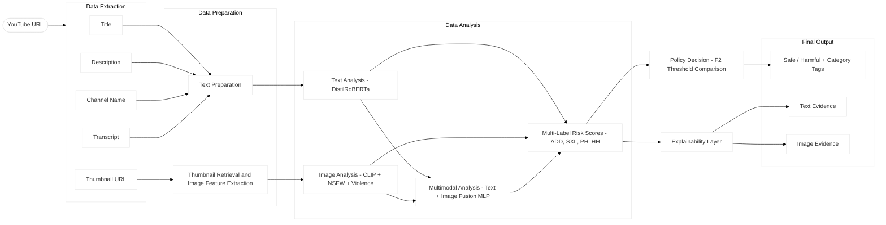

# GuardAI Kids



GuardAI Kids is a YouTube content safety analyzer for children. Given a YouTube URL, it classifies the video as **Safe** or **Harmful** across four harm categories: addictive content (ADD), sexual/explicit material (SXL), physical harm (PH), and hate/harassment (HH). When harmful content is detected, the system surfaces which categories fired and provides supporting evidence from text and thumbnail signals.

## How It Works

The system supports three analysis modes:

| Mode | What it uses |
|---|---|
| `text` | Video title, description, and transcript |
| `image` | Thumbnail image features (CLIP + NSFW + violence classifiers) |
| `multimodal` | Text and image combined via a fusion layer |

Each mode runs a trained multi-label classifier over four harm categories. Thresholds are recall-weighted (F2-optimized) and loaded from each artifact at runtime.

## Model Performance (Validation Set, n = 2,767)

| Model | Mean AUC | Macro F1 |
|---|---|---|
| text only | 0.939 | 0.783 |
| image — clip_nsfw_violence | 0.846 | 0.586 |
| multimodal — clip_nsfw_violence | 0.935 | 0.782 |

Full comparison graphs are in `artifacts/reports/`.

## Repo Structure

- `src/guardaikids/` — all modules: data, modeling, policy, explainability, workflow, YouTube integration, CLI, web UI
- `scripts/` — dataset preparation, image feature extraction, report generation, results snapshot
- `data/` — place `Harmful.xlsx` and `Harmless.xlsx` here
- `artifacts/` — final artifact directories (`text`, `image_clip_nsfw_violence`, `multimodal_clip_nsfw_violence`) with metadata, predictions, and evaluation reports (model weights excluded — regenerate by training)
- `tests/` — lightweight regression tests

## Requirements

- Python 3.12
- A YouTube Data API key (for live URL analysis)
- `data/Harmful.xlsx` and `data/Harmless.xlsx` with columns: `harm_cat`, `title`, `description`, `transcript`, `video_id`
- NVIDIA GPU recommended for training (CPU works but is slow)

## Setup

### 1. Create environment and install

```powershell
python -m venv .venv
.\.venv\Scripts\Activate.ps1
python -m pip install --upgrade pip
python -m pip install torch torchvision torchaudio --index-url https://download.pytorch.org/whl/cu121
python -m pip install -r requirements.txt
python -m pip install -e .
```

For CPU-only, replace the torch line with:

```powershell
python -m pip install torch
```

### 2. Configure environment

Create a `.env` file in the project root:

```
YOUTUBE_API_KEY=your_api_key_here
```

### 3. Place dataset files

```
data/Harmful.xlsx
data/Harmless.xlsx
```

## Training

### Text mode

```powershell
python -m guardaikids train --mode text --artifact-dir artifacts/text
```

### Image mode

```powershell
python scripts/extract_image_features.py --image-analysis-model clip_nsfw_violence
python -m guardaikids train --mode image --image-analysis-model clip_nsfw_violence --artifact-dir artifacts/image_clip_nsfw_violence
```

### Multimodal mode

```powershell
python -m guardaikids train --mode multimodal --image-analysis-model clip_nsfw_violence --artifact-dir artifacts/multimodal_clip_nsfw_violence
```

## Evaluation

```powershell
# Generate 7-way comparison graphs and summary CSV
python scripts/save_results_snapshot.py

# Generate full experiment report
python scripts/generate_experiment_report.py
```

Outputs go to `artifacts/reports/`.

## Web UI

```powershell
python -m guardaikids.web_interface
```

Open `http://127.0.0.1:5000`. Select `text`, `image`, or `multimodal`.

## CLI Analysis

```powershell
python -m guardaikids analyze --mode text --url "https://www.youtube.com/watch?v=VIDEO_ID"
python -m guardaikids analyze --mode multimodal --url "https://www.youtube.com/watch?v=VIDEO_ID" --json
```

## Troubleshooting

**First run downloads models from HuggingFace** — expected for CLIP, NSFW classifier, and violence classifier on first image/multimodal run.

**GPU not detected:**

```powershell
python -c "import torch; print(torch.cuda.is_available())"
```

**Web UI says `YOUTUBE_API_KEY is required`** — check that your `.env` file is in the project root and contains `YOUTUBE_API_KEY=...`.

## Running Tests

```powershell
python -m unittest discover -s tests -v
```

## Notes

- Model weights are not committed (too large). Run training to regenerate them.
- `artifacts/*/metadata.json` and `predictions_*.json` are committed and contain all evaluation metrics.
- Decision thresholds can be reevaluated from saved predictions without retraining using `scripts/reevaluate_policy_from_predictions.py`.
