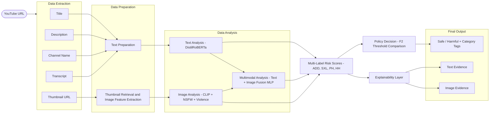
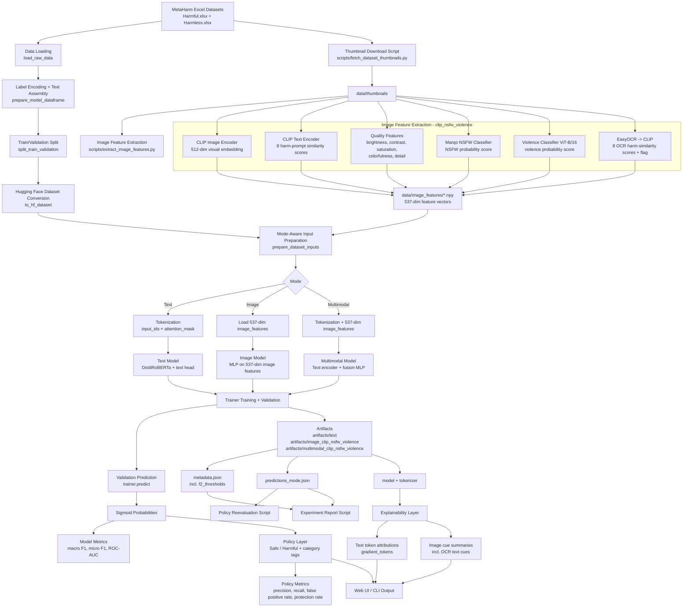
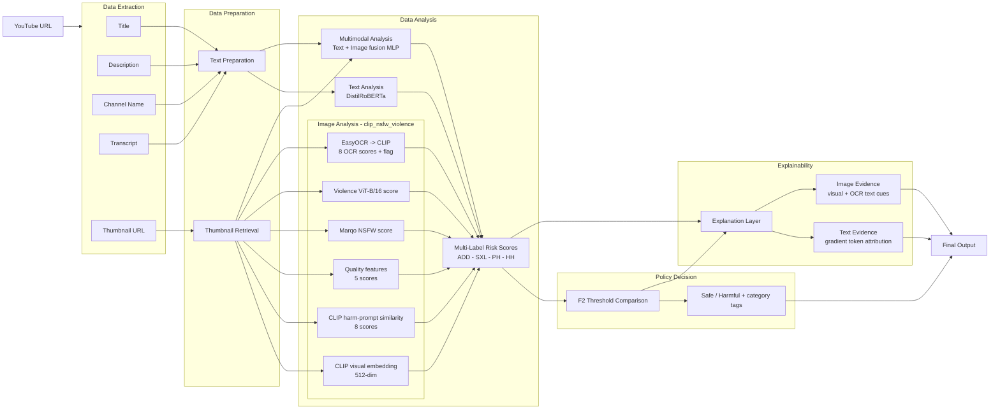
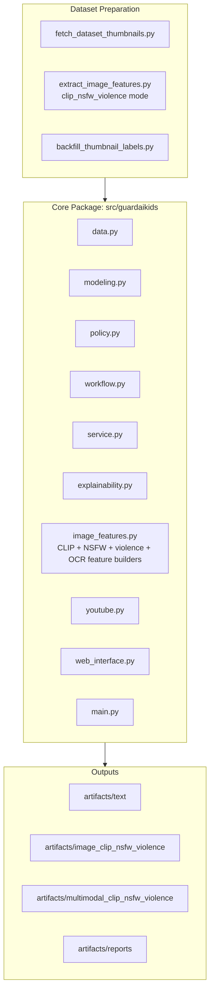

# GuardAI Kids System Diagram

## High-Level Overview

## Full Pipeline

## Runtime Analysis Flow

## Component View

## Image Feature Vector Layout (clip_nsfw_violence)

| Dimensions | Source | Model |
|---|---|---|
| 0-511 | Visual embedding | CLIP ViT-B/32 image encoder |
| 512-519 | Harm-prompt similarity (visual) | CLIP text encoder x 8 prompts |
| 520-524 | Quality features | Handcrafted (brightness, contrast, saturation, colorfulness, detail) |
| 525 | NSFW score | Marqo/nsfw-image-detection-384 |
| 526 | Violence score | jaranohaal/vit-base-violence-detection (ViT-B/16) |
| 527 | has_ocr_text flag | EasyOCR gate |
| 528-535 | Harm-prompt similarity (OCR text) | CLIP text encoder x 8 prompts |
| 536 | Missing image flag | - |

**Total: 537-dim**

## Notes

- Text mode uses `distilroberta-base` with CLS-token style pooling.
- Image and multimodal modes use precomputed 537-dim thumbnail features (`clip_nsfw_violence` backend).
- Multimodal fusion concatenates the 768-dim text embedding with the 537-dim image vector, then applies an MLP fusion head.
- Decision thresholds are F2-optimized per label per mode and stored in each artifact's `metadata.json`. They are loaded at runtime - no hardcoded thresholds.
- Explainability is gradient-based for text tokens and cue-summary-based for image features (including OCR text cues).
