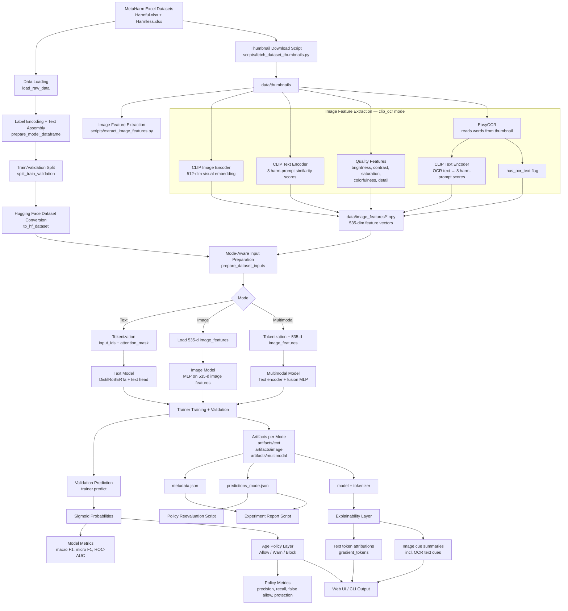
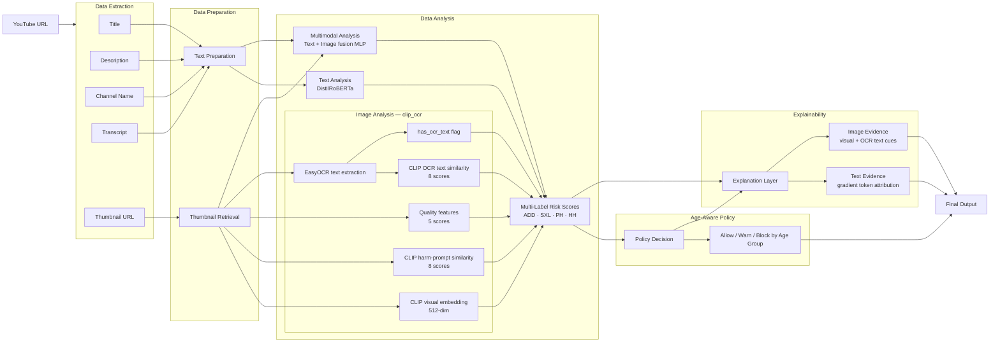
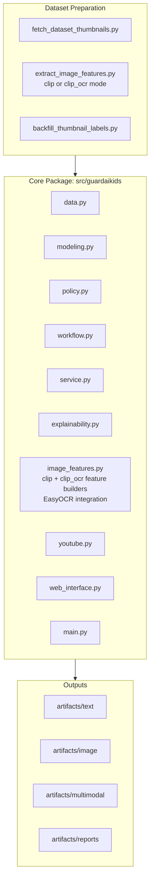

# GuardAI Kids System Diagram

## Full Pipeline

## Runtime Analysis Flow

## Component View

## Image Feature Vector Layout

| Dimensions | Source | Model |
|---|---|---|
| 0–511 | Visual embedding | CLIP image encoder |
| 512–519 | Harm-prompt similarity (visual) | CLIP text encoder × 8 prompts |
| 520–524 | Quality features | Handcrafted (brightness, contrast, saturation, colorfulness, detail) |
| 525 | Missing image flag | — |
| 526–533 | Harm-prompt similarity (OCR text) | CLIP text encoder × 8 prompts `clip_ocr only` |
| 534 | has_ocr_text flag | EasyOCR `clip_ocr only` |

**Total: 526-dim (`clip`) · 535-dim (`clip_ocr`)**

## Notes

- Text mode uses `distilroberta-base` with CLS-token style pooling.
- Image mode uses precomputed `535`-dim thumbnail features when `IMAGE_ANALYSIS_MODEL = "clip_ocr"`.
- `clip_ocr` adds EasyOCR text extraction on top of CLIP visual features. OCR text is encoded by the same CLIP text encoder already loaded, then compared against the same 8 harm prompts.
- OCR text is truncated to CLIP's 77-token limit before encoding.
- Multimodal mode concatenates text embedding and image features, then applies an MLP fusion head.
- Policy decisions are separate from model training and can be reevaluated from saved predictions.
- Explainability is currently gradient-based for text and cue-summary-based for image (including OCR text cues).
- Switching back to `clip` (526-dim) requires changing `IMAGE_ANALYSIS_MODEL` in `config.py` and retraining.
